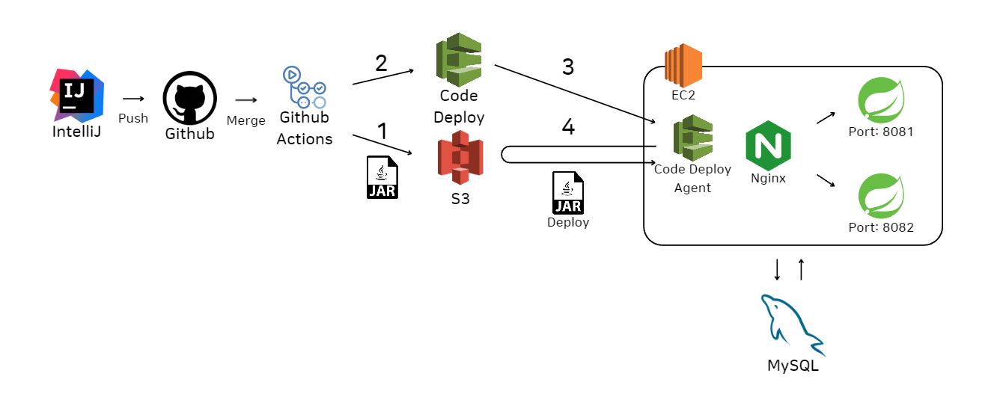

# 프로젝트: 로드메이커
## 개인 프로젝트: 0 부터 다시 해보기 | 서버
한 달간 진행했던 내용에 대해 되짚어보기
### 1. Tech Stack
- Language: Java 17
- Framework: Spring Boot 3.1.3
  - Build: Gradle
  - DB: JPA, Hibernate, QueryDSL
  - 초기 dependency: Spring Boot DevTools, Lombok, Spring Web, Spring Security, Spring Data JPA, Spring Data JDBC
- DB: MySQL 8.0.34, Redis
- CI/CD: Github Actions, Code Deploy, S3, EC2, Nginx
- Static Analysis: Sonar Cloud
- IDE: IntelliJ IDEA 2023.1
### 2. Outline
#### 1. CI/CD 구축: Github Actions를 이용한 Blue/Green 배포
   - AWS 서비스 설정: Code Deploy, EC2 등 연동
   - Code Deploy를 이용한 코드 배포
   - NginX를 통한 백포워딩

#### 2. DB 설정 및 연결: MySQL & Redis
#### 3. 로그인, 회원 가입 기능 구현
   - JWT token
   - Spring Security
#### 4. 외부 API(GPT API)이용한  API 구현
   - 스레드 풀을 이용한 멀티스레드 콜
#### 5. 인증 기능 구현
#### 6. 기타 기능 구현
   - 검색
   - 댓글
#### 7. 섬네일 이미지 최적화
   - Spring Boot와 AWS S3 연동: 온디맨드 리사이징
### 3. Project Development(2023.10 ~, 팀 프로젝트로)
1. 로그인 기능: OAuth2를 이용한 소셜 로그인
2. GPT API 멀티스레딩: 많은 사람들이 사용하는 경우에 대한 대처
3. 생성 결과 캐싱(Elastic Search 기능과 연동)
4. 로드맵 기능 자체에 대한 폴리싱
5. 코드 리팩터링: 논의 예정
   - 기존 구현 기능의 성능 개선
   - 환경의 필요에 맞게 개편
   - 모듈화, 사용이 쉬운 코드로
6. 사용자들에게 서비스 제공이 목표
7. 이후 필요에 따라 서비스 발전시켜 나갈 것
### 4. Etc
- 생각나는 대로 추가 예정